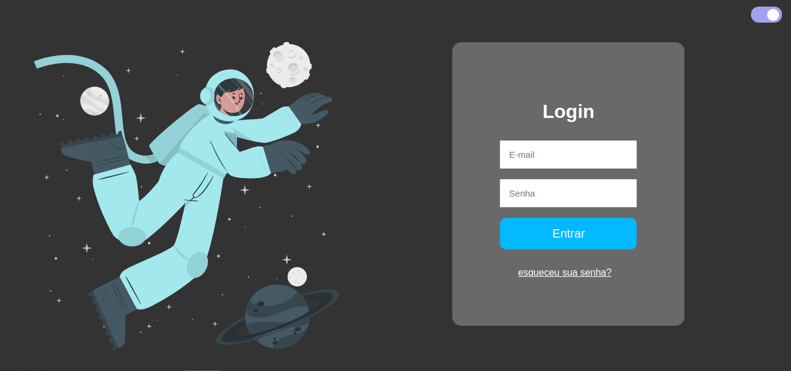

  <a href="#-tecnologias">Tecnologias</a>&nbsp;&nbsp;&nbsp;|&nbsp;&nbsp;&nbsp;
  <a href="#-projeto">Projeto</a>&nbsp;&nbsp;&nbsp;|&nbsp;&nbsp;&nbsp;
  <a href="#-layout">Layout</a>&nbsp;&nbsp;&nbsp;|&nbsp;&nbsp;&nbsp;

 

 

## 🚀 Tecnologias

Esse projeto foi desenvolvido com as seguintes tecnologias:

- HTML
- CSS
- JavaScript

Bibliotecas

- [Google Fonts](https://fonts.google.com/)
- [Storyset Customize](https://storyset.com/)

## 💻 Projeto

Este projeto foi desenvolvido com a ideia de trazer temas Dark/ligth Mode e animações na pagina de login.

## 🔖 Layout

Você pode visualizar o layout do projeto através [desse link]()

Feito com ♥ by LucasRodrigues